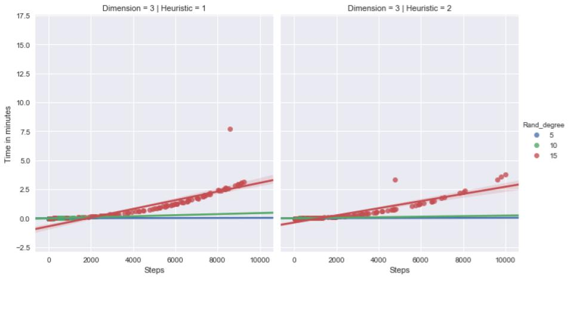
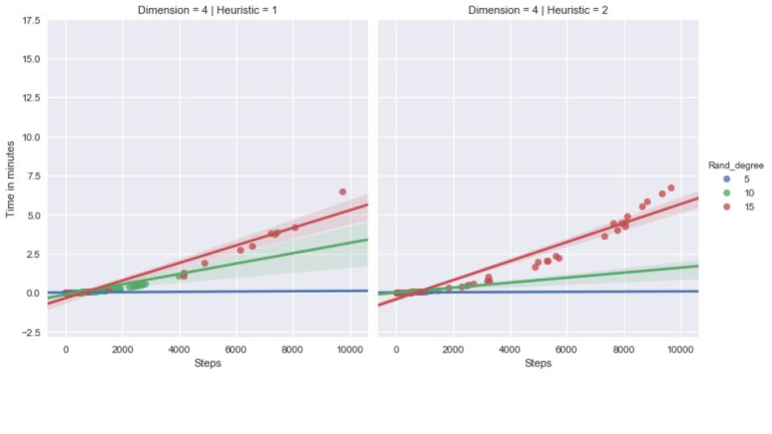
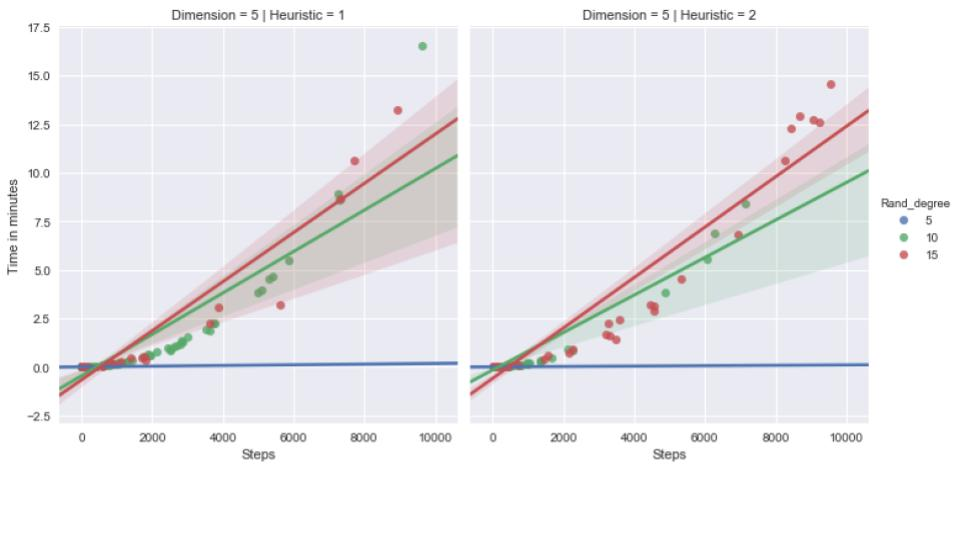
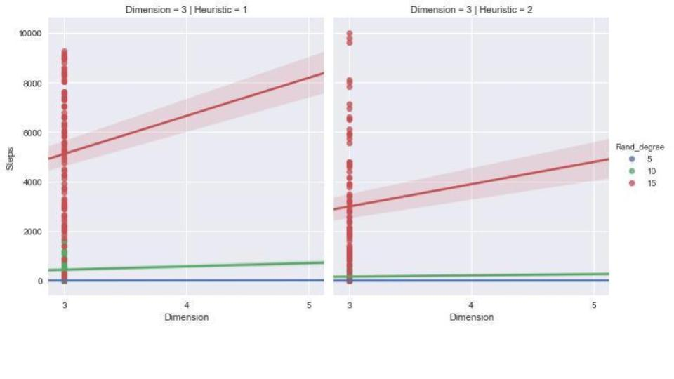
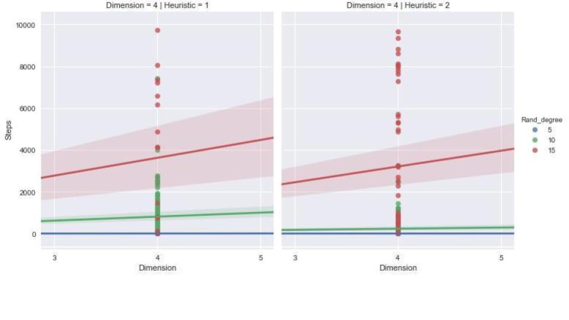
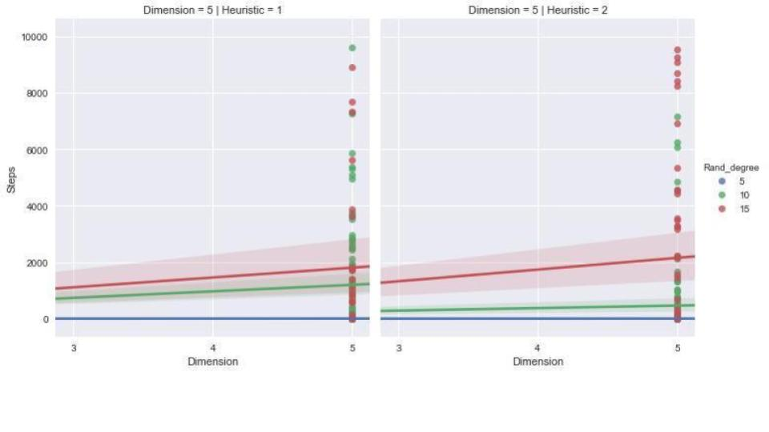
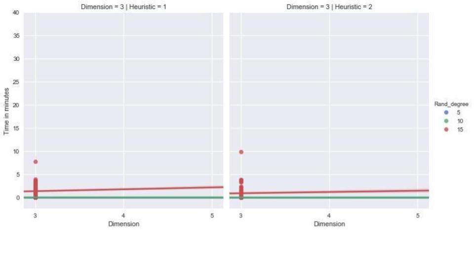
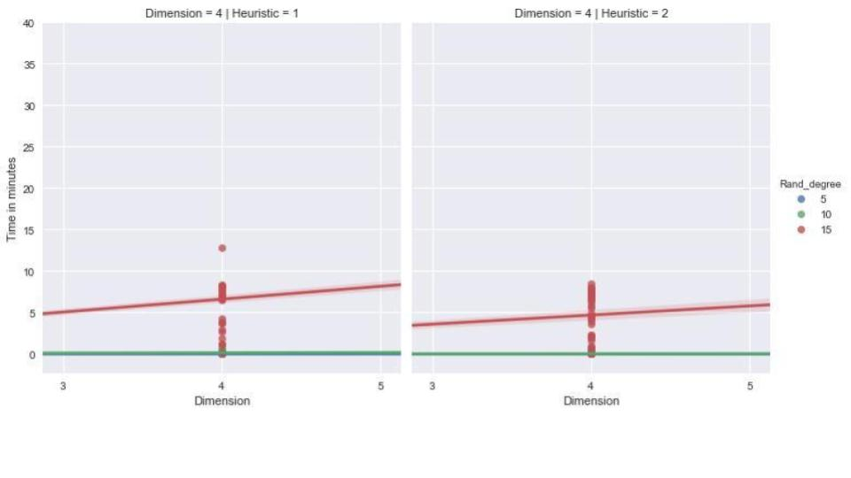
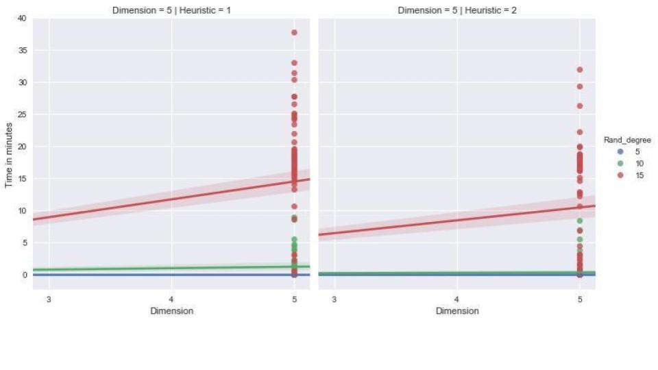

# AI @JCE 2017

#### Prof. Rachel Ben-Eliyahu-Zohary

#### Project by <a target="_blank" href="https://github.com/mwindowshz">Meir Zilkha</a> and <a target="_blank" href="https://github.com/ilyakrasnov">Ilya Krasnov</a>


---

## Project Objectives

+++

* Compare performance of heuristics for A*
* Apply to a given problem set
* Make exploration visible and accessible

---

## Problem Set

+++

* Randomized 8 Puzzle
* Implement A* algorithm with different heuristics
	 * Number of Misplaced Tiles
	 * Sum of Manhattan Distances
* Visualize solving path

+++

* Test run algorithm on several puzzel dimentions with 100 randomized puzzles each
	 * 3x3
	 * 4x4
	 * 5x5


+++

## Short Recap of A*

* Uses *Best First Search* approach to traverse the graph
* Uses a heuristic function to decide what is the next step: ```F(n) = g(n) + h(n)```

* g(n): number of steps done until this point
* h(n): a heiristic assumption how many more steps until goal state reached

+++

**If F(n) is Admissable then A* is complete and Optimal**


---

## Tools, Language & Frameworks

+++

* Webapp developed in Typescript (Angular)
* Source control: Git
* Automatic build and hosting: AWS CodePipeline, CodeBuild, S3
* Data analysis: Pandas, Numpy (Jupyter Notebook)
* Data visualisation: Seaborn

---

##<a target="_blank" href="http://ngdeploy.ilyakrasnov.s3-website-us-west-2.amazonaws.com">LIVE PREVIEW</a>

---

## Online Game

+++

### Main Components

* **PuzzleCreator** creates randomized boards with different dimensions
* **AStar** implements the search algorithm with different heuristics
* **Stats** defines and runs the experiment


+++

### Challenges - Randomization

1. **Total Randomization** (shuffle) with assured solvability
2. **Supervised Randomization** (make x random moves) - **chosen at the end**

---

## A* Implementation

+++

### Heuristics


---

## Experiment

+++

### Pseudo Code
<a target="_blank" href="https://github.com/ilyakrasnov/ai_project_jce17/blob/master/images/psudo_code.PNG">Click</a>

```JavaScript
dimensions = [ 3, 4, 5 ]
rand_degrees = [ 5, 10, 15 ]
nr_of_iterations = 100
heuristic_functions = [ h1, h2 ]

results = []

for (dimension of dimensions) {
	for (rand_degree of rand_degrees) {
		nr_of_iterations times do {

			// Setup
			puzzle = create_randomized_puzzle(dimension, rand_degree)

			// Run
			steps1, time1 = aStar.run(puzzle, h1)
			steps2, time2 = aStar.run(puzzle, h2)

			// Record
			results.push({ dimension, rand_degree, steps1, time1 })
			results.push({ dimension, rand_degree, steps2, time2 })
		}
	}
}

return results
```

+++

### Challenges

* Long and unpredictable runtimes
* Introduced threshold for number of steps

---

## Observation and Insights

+++

| h |  Max. Time  | Min. Time | Mean. Time |  Max. Steps | Min. Steps  | Mean Steps  |
|:---:|:---:|:---:|:-:|:---:|:---:|---:|
| h1  | 16.5 | 1.15 * 10<sup>-5</sup>  |  0.40 |  9737 | 2 | 1142 |
| h2 | 14.5  | 1.09 * 10<sup>-5</sup>  | 0.33  | 9995  | 2 | 783 |

+++

### Randomization Degree

Randomization degree influence is not always clear, when using a larger board the influence of higher Rand Degree has smaller effects.


+++



+++



+++



+++ 

### Is H2 Better Than H1?

+++

**Simple intuition**: h2 gives more information on how far you are from the goal state, thus h2 should be better.

+++

### Steps Comparison 1

+++



+++



+++



+++

### Steps Comparison 2

Not every search finished within the given steps threshold (10,000)

* h1 finished with result in `81%` of the tests
* h2 finished with result in `87%` of the tests
* Mean # of steps for h1: `1142`
* Mean # of steps for h2: `783`

+++

### Time Comparison

+++



+++



+++



+++

### Time vs Steps

+++

The higher the randomization degree of a board, the more time it takes for any alogrithm to solve it:


+++

The number of steps declines at certain point for higher randomization degrees and board dimensions:


---

## The End


####<a target="_blank" href="https://github.com/ilyakrasnov/ai_project_jce17/blob/master/README.md">Full Report</a>
