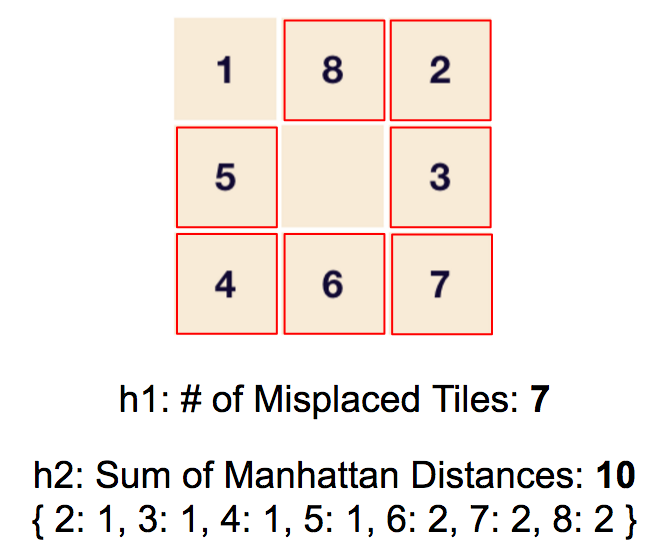

# AI @JCE 2017

#### Prof. Rachel Ben-Eliyahu-Zohary

#### Project by [Meir Zilkha](https://github.com/mwindowshz) and [Ilya Krasnov](https://github.com/ilyakrasnov)


---

## Project Objectives

+++

* Compare performance of heuristic functions for A*
* Apply to a given problem set
* Make exploration visible and accessible

---

## Problem Set

+++

* Randomized 8 Puzzle
* Implement A* algorithm with different heuristics
	 * Number of Misplaced Tiles
	 * Sum of Manhattan Distances
* Visualize solving path

+++

* Test run algorithm on each 100 randomized puzzles with for different dimensions
	 * 3x3
	 * 4x4
	 * 5x5

	 
+++ 

## Short Recap of A*

* Uses *Best First Search* approach to go over a graph, from a starting state getting to a Goal state.
* Uses a heuristic function to decide what is the next step.

```F(n) = g(n) + h(n)```

* g(n): number of steps done until this point
* h(n): a heiristic assumption how many more steps until goal state reached)

**If F(n) is Admissable then A* is complete and Optimal.**
	 

---

## Tools, Language & Frameworks

+++

* Webapp developed in Typescript (Angular)
* Source control: Git
* Charting library: tbd

---

## Live Preview

+++ 

###[CLICK HERE](ngdeploy.ilyakrasnov.s3-website-us-west-2.amazonaws.com)

---

## Online Game

+++ 

### Main Components

* *PuzzleCreator* creates randomized boards with different dimensions
* *AStar* implements the search algorithm with different heuristics
* *Stats* defines and runs the experiment


+++

### Challenges - Randomization

1. Total Randomization (shuffle) with assured solvability
2. Supervised Randomization (make x random moves) - **chosen at the end**

---

## A* Implementation

+++ 

### Heuristics



---

## Experiment

+++ 

### Pseudo Code

```
dimensions = [ 3, 4, 5 ]
rand_degrees = [ 5, 10, 15 ]
nr_of_iterations = 100
heuristic_functions = [ h1, h2 ]


results = []

for (dimension of dimensions) {
	for (rand_degree of rand_degrees) {
		nr_of_iterations times do {
		
			// Setup
			puzzle = create_randomized_puzzle(dimension, rand_degree)
			
			// Run
			steps1, time1 = aStar.run(puzzle, h1)
			steps2, time2 = aStar.run(puzzle, h2)
			
			// Record
			results.push({ dimension, rand_degree, steps1, time1 })
			results.push({ dimension, rand_degree, steps2, time2 })
		}
	}
}

return results
```

+++ 

### Challenges

* Long and unpredictable runtimes
* Introduced threshold for number of steps

---

## Observation and Insights