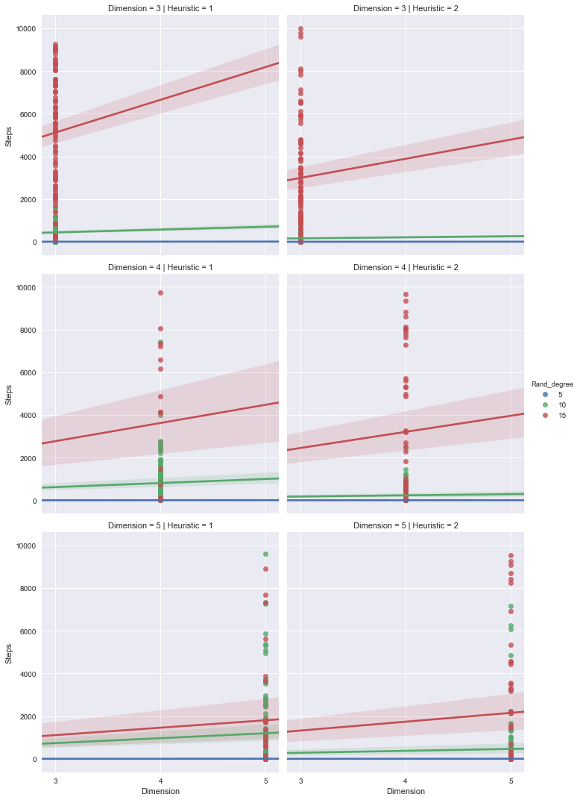
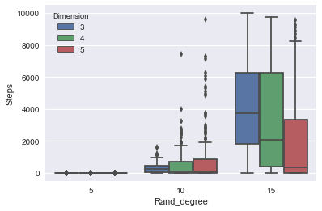

## Overview

### 8 puzzle game

In 8 puzzel game the goal is to reorder tiels from a start state to the goal state


    
       
When trying to implement an algorithem for solving 8 puzzel - the main considiration is to choose what is the next step, what tile to move on board. this would determine if we are getting closer to the goal or not.


    
The problem of 8 puzzel, can be presented as a Graph **Search problem**. 

There are diffrent scemes of graph searching  possible, some are compleate , some give optimal results.

### Complete and Optimal Sotions.

The 8 puzzel problem could not always be solved, there are start states that don't have a solution.

*Compleate* means if there is a solution the algorithem would find one.

*Optimal* means - the solution found is the optimal, in our case - minimal number of steps taken to solve the puzzle.

### Fringe and Closed


A Search algortion uses 2 basic lists for calculating the next step, *Fringe* and *Closed*.

*Fringe* holds the next possible steps- or expanded steps, while *Closed* holds the states that were already chosen in the path to solving the problem.

A sucsessor function expands a node, finding what are the next possible steps . 
the desicion of what goes into the list and in what order depends on the Search algorithm.


 Image fringe.
 Image fringe state and closed state.
 
### A* Search 
 
A* algorithem, uses *Best First Search* approch to go over a graph, from a starting state getting to a Goal state.

A* uses a huristic function to decide what is the next step.

```F(n) = g(n) + h(n)```

* g(n): number of steps done until this point
* h(n): a heiristic assumption how many more steps until goal state reached)

If F(n) is Admissable (קבילה) then  A* is complete and Optimal.


## Problem description
The project consisted of a few parts.

1. Creating an online 8puzzle game
2. Implementing the A* algorithm
3. Exploration of A* performance with different heuristic functions

## Creating an online 8puzzle game
### Dev environment and tools
The [online game](http://ngdeploy.ilyakrasnov.s3-website-us-west-2.amazonaws.com/) was developed in [TypeScript](https://www.typescriptlang.org/) using the [Angular](https://angular.io/) framework for frontend development. The framework enables fast development process with reusable components and supporting application structure.

The source code is accessible in this [GitHub repository](https://github.com/ilyakrasnov/ai_project_jce17). We used [AWS Codepipeline](https://aws.amazon.com/codepipeline/) and [AWS Codebuild](https://aws.amazon.com/codebuild/) to automate the build and deployment process of the application. 

Further data analysis was performed using an iPython notebook and data and vizualisation libraries like Pandas, Numpy and Seaborn.

### Architecture Overview
The game and later the algorithm were developed using Object Oriented Design for better structure and code reusability. Since it was not the main subject of this project, we only present here basic classes and their responsibilities briefly.

#### Puzzle

The *Puzzle* class represents the whole game, connecting all other application parts together and presenting them on the webpage. 

#### Board
The *Board* class represents the setup of a game board, with its dimensions, numbers, etc. The main function of the board is to return a list of possible moves aka 'neigbors' of the empty tile.

#### PuzzleCreator
*PuzzleCreator*'s task is creating a randomized board with given dimensions and a board representing the goal state. 

#### Movement
The *Movement* class performs the basic step of moving a tile. In afterthought it was a very good decision to abstact out this class, since we later were able to make use of it in both the online game and the algorithm searching for the solution.

#### AStar
At the core of the algorithmic part of the implementation is the *AStar* class. It defines the heuristic functions as well as the overall search algorithm with node expansion, managind the *Fringe* and *Closed* lists, etc.

####  Stats
In order to collect the data, we created the *Stats* class, which defines the setup and execution of our expriment, collects and outputs the results represented as a *JSON* file.

### Unique challenges - Randomization

One of the intersting and challenging aspects we faced was randomization of the board when generating the puzzle. Further we discuss the 2 approaches we took and the reasons why we decided to finally use only one of them.

#### Approach 1
Our first approach was to create a board of a given dimension *d*, i.e. 3x3, 4x4, etc, and randomly assigning numbers from *1 to d<sup> 2</sup> - 1*, leaving one tile empty. However not each randomly created puzzle is solvable. As discussed [here](https://www.cs.bham.ac.uk/~mdr/teaching/modules04/java2/TilesSolvability.html), there is an algorithm to check if a particular board setup is sovable. Using the described algoritm to determine solvability we then only generated solvable puzzles.

As we will see in later discussions, a particular setup, though being theoretically solvable, may take a lot of steps/time for the algorithm to actually find a solution. 

This approach turned out to be challenging for following reasons:

* The user would wait for a long time when generating the algorithmic solution
* Testing the *A** algorithm during the development process became long and unpredictable

We then decided to try another approach, with several advantages over the first one.

#### Approach 2
The second approach was to take the goal state of the puzzle and make a number of valid moves. In each step of the process we know the possible moves we can make, i.e. the tiles we can move. By randomly picking one of them we could randomize the puzzle in each step, always knowing how many steps at most the current board is far from the goal state.

A refinement we also implemented was to prohibiting a tile from being moved twice in a row, thus returning to the same state after two consecutive moves. This distinction helped us to reliably create a randomized boards and also introduced another dimension of measurement, we previously were not intending of measuring, the *degree of randomization*.


## Implementing the A* algorithm
We chose two diffrent heruristic functions and explored the diffrence in performance counting number of steps, and time.


### h1 - Number of Misplased Tiles
Counting the number of misplaced tiles. The rational of this is - you need to move at least x tiles to achive the goal state. (x is the number of misplaced tiles).

*This function is  Admissable.*
    

### h2 - Sum of Manhatten Distances
Counting the number of steps in manhaten distances for each misplased tile.

The rationel of this huristic funciton is to tell us, how many moves a tile would need at least to get to it's place in the Goal posistion. 

This approach acctualy gives us more information about how many steps would be required to achive the goal state.


*This function is  Admissable.*
    


### Challenges
It was not easy to implemet, there are many "moving parts" and there were many adjustments and corrections needed. 

We used *Logging* and *Visualization* of the working algorithm displaying each step displaying the Fringe states, and Closed states. thies helped understanding what the algorithem was  acctualy doing and what corrections were requiered. 


 
## Exploration of A* performance with different heuristic functions

### Experiment setup
The goal of the experiment was to compare how different heuristic functions perform for different puzzle dimension and different degrees of randomization. Following variables were introduced:

* `dimensions: [ 3, 4, 5 ]`
* `rand_degrees: [ 5, 10, 15 ]`
* `nr_of_iterations: 100`
* `heuristic_functions: [ h1, h2 ]`


### Collecting the data

#### Pseudocode for Data Collection

```
results = []

for (dimension of dimensions) {
	for (rand_degree of rand_degrees) {
		nr_of_iterations times do {
		
			// Setup
			puzzle = create_randomized_puzzle(dimension, rand_degree)
			
			// Run
			steps1, time1 = aStar.run(puzzle, h1)
			steps2, time2 = aStar.run(puzzle, h2)
			
			// Record
			results.push({ dimension, rand_degree, steps1, time1 })
			results.push({ dimension, rand_degree, steps2, time2 })
		}
	}
}

return results
```

This setup enabled us to collect 1800 data entries, collecting up to 100 observations for each heuristic on every combination of dimension and randomization degree.


### Challenges

#### Runtime / Amount of Steps
One of the most challenging parts of data collection is the runtime of the algorithm. High dimensions, even 5x5, and high degree of randomization, 15, increase the runtime of the algorithm to sometimes 25-30 minutes. With the setup introduced before, the data collection process took about 3 days for a `MacBook Air 2013` to complete. 

As discussed prior to the project start, we also introduces an upper bound for algorithm steps, `b = 10000`. If the algorithm takes more than `b` steps, the returned value for steps is `undefinded` or missing. For data analysis purpuses it is treated as `NaN`.  


#### Saving the Results
Due to the chosen architecture, the calculations were done by the JavaScript engine inside the browser. There is no easy way to write to the file system directly from the execution thread. Thus the results were output to the console at the end of the run. 

In case the computer was restarted or crashed without any input on our side, it needed to be frequently monitored and the calculation process restarted if needed.


## Observations and Insights

As dscribed above, we checked diffrent scenarios, board dimentions, randomization degree and huristic functions.
we used the data collected and plotted diffrent views, to get insights into the results


* Randomization degree influence is not always clear, when using a larger board the influence of higher Rand Degree has smaller effects


---image 1 - each board size, comparing h1 and h2 with diffrent rand degree.


#### Is h2 better than h1 
on smaller board, larger boards there is less difference
image - 4 - by steps  h2 is better on small board, larger board less of a difference 


image 5-  by time   - h2 seems better


2. difference between steps and time -
image - 2,  3


time is more clear, steps can vary
also can be observed that larger board, is not effected by higher rand degree.

--- image 6  - decide  if to add this image (we can see that in heiger rand degree the size of the board matters, in a larger board )



3. 
### Collected data imbalance
there are diffrent amount of results for each board size

h1 - did not solve the puzzel as well as h2. it took more steps, therefore, in more cases the search did not compleate. it took more then 10,000 steps.
h1 finished with result in 81% of the testes
h2 finished with result in 87% of the testes

mean of steps number
h1 is higher then h2. 1142 vs 783 steps

h1 - max time to solve a board was 16.5 minutes. (dim 5 rand deg - 10)
h2 - max time to solve a board was 14.5 minutes 

h1 mean time to solve a board - 0.4 minutes 
h2 mean time to solve a board-  0.33 minutes

h1 std is 1.3 min
h2 std is 1.4 min


